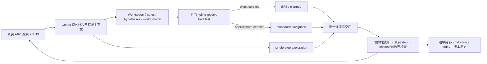

# Schema-style Harness 实现与实验复盘

日期：2026-08-01  
对象：`arc-schema-reproduction` / ARC-AGI-3 `ls20`  
用途：详细汇报、实验答辩与后续复现设计

配套可视化网页：[`docs/harness-results/`](harness-results/)

## 1. 一页结论

本项目不是在一次运行中直接得到成功结果，而是经历了从基础闭环、FSM 失败、可执行程序世界模型、科学审计门禁、受监控导航，到 Codex workspace-native runtime 的连续迭代。仓库现存 30 个正式实验目录、13 个 pilot 目录和 3 个 C0.5 Toy 验收目录；其中既包含能力结果，也包含协议、网络和预算边界暴露出的负结果。

当前最重要的结果是：在 `ls20`、seed 0、同一 `gpt-5.6-sol xhigh`、vision on、72 次模型调用上限、800 个环境动作上限和相同多维 token/notional/墙钟上限下：

- Full Schema harness 完成 **2 Levels**；
- 允许每次直接提交 1–16 个动作的 batched direct baseline 完成 **1 Level**；
- 两边都因 72-call 上限停止，均无模型、网络、协议或工具失败；
- 因此得到一个**单游戏、单 seed、同上限条件下观察到的 +1 Level completion gap**。

这个结果有说服力，但边界必须说清：它是单 seed 的描述性配对结果，不是跨 seed 的统计证明；两次实验分别运行，因此各自 `experiment.json` 的机器字段仍是 `paired_valid=null`，可比性来自预注册设计和事后配置审计，而不是同一个 A/B runner 对象；两边共享资源上限，但实际消耗并不相等，不能把结果表述成“同成本下”的优势。

当前 harness 的能力也不能简化为“BFS 解决了游戏”。成功 Full run 的 496 个环境动作由 18 个探索动作、461 个受监控 navigation 动作、14 个严格 BFS-derived planned 动作和 3 次 reset 构成。更准确的结论是：**持久世界模型、外显笔记/假说、逐动作预测校验、可恢复的导航通道和少量严格搜索共同组成的 Schema-style 系统，提高了该条件下的关卡完成数。**

## 2. 当前 Harness 到底实现了什么



### 2.1 环境与可复现运行层

- 统一 `Environment` 协议与 ARC adapter，正确处理 ARC SDK 的 `FrameDataRaw | None`、动态合法动作、`WIN/GAME_OVER` 和 level checkpoint。
- baseline 与 harness 共享游戏、seed、模型、视觉、预算和停止条件配置。
- 动作数、模型调用、总 token、uncached prompt、output、每调用 reserve、notional proxy 和墙钟共同限流。
- 首次不可恢复的 Codex/网络/协议故障 fail fast，不用盲目动作填满预算。
- 每次 level-up 保存动作、调用和 token 快照；GAME_OVER reset 计入环境动作并保留同一 Timeline。

主要实现位于 [`environment.py`](../src/arc_schema/environment.py)、[`runner.py`](../src/arc_schema/runner.py)、[`evaluation.py`](../src/arc_schema/evaluation.py) 和 [`config.py`](../src/arc_schema/config.py)。

### 2.2 持久 Workspace 与可执行世界模型

每个 harness run 都维护：

- `world_model.py` 与 `wm_versions/`；
- `notes.md` 与 `notes_history/`；
- `hypotheses.json` 与 `hypothesis_versions/`；
- 高对比、近邻放大的 `vision_frames/`；
- 分类索引 `trace_index.md`；
- Codex 原生事件流 `codex-cli-events.jsonl`。

世界模型支持传统 `step(state, action) / is_goal(state)`，也支持更适合关卡边界的 latent/event 接口。模型代码在受限沙箱中执行，禁止文件、网络、危险导入和 dunder 访问。完整磁盘历史可以持续累积；给模型的假说上下文会裁剪 lineage 和大体积 delta，避免上下文随运行无限膨胀。

### 2.3 三种动作通道及其科学含义

| 通道 | 允许内容 | 认证要求 | 是否算 BFS 规划 |
|---|---|---|---|
| `exploration` | 一次一个动作，可绑定分辨实验 | 不要求已有完整目标模型 | 否 |
| `navigation` | 面向交互点或子目标的短动作串 | 当前世界模型已通过 exact 或非终局 approximate replay；逐动作预测和监控 | 否 |
| `planned` | 当前 observation 上的 BFS 完整动作序列 | 全 Timeline exact，绑定当前 WM version、`plan_id`，动作必须与 BFS 输出完全一致 | 是 |

navigation 不是“放宽后盲走”。每一步都在执行前生成 prequential prediction；真实结果若 mismatch、非法、跨 level、GAME_OVER/WIN 或触及任一预算边界，剩余 burst 立即停止。approximate certification 只允许 navigation，不能给 BFS/planned 开绿灯；level/WIN/GAME_OVER 和动作空间始终严格。

### 2.4 可追溯性与防污染

- 所有观察、模型请求/响应摘要、提交、预测、真实 transition、mismatch、level boundary、笔记/WM/假说修订都写入 SHA-256 哈希链 JSONL。
- `trace_index.md` 按 level、WM/假说、backtest/BFS、commit、prequential、mismatch/reset 和预算停止分类。
- baseline 禁止 Schema workspace、可执行 WM、BFS、文件/仓库读取和 shell/tool；最终 batched baseline 目录中没有 notes、WM、hypotheses 或 trace index，未发现 treatment contamination。
- Codex 内部隐藏推理文本没有被当作研究证据保存；事件流保留 thread/turn、agent message 和 token usage。可复核的“思维路径”来自模型主动外化的 notes、假说状态、WM diff、BFS/commit 和逐动作证据，而不是声称掌握私有 chain-of-thought。

### 2.5 `confirmed → supported` 自动规范化的定位

假说账本的规范状态只有 `active | supported | rejected | uncertain`。模型偶尔输出非规范词 `confirmed` 时，协议层只做确定性的词汇映射 `confirmed → supported`，并把原状态、目标状态写入审计记录。

这不是人工替模型确认机制，也不改写 statement、证据 sequence 或 reason；它相当于 JSON schema adapter，避免一个同义状态词让整轮失败。若内容本身缺证据或与 replay 矛盾，后续认证和反例机制仍会拒绝或修订它。因此该修复减少的是协议噪声，不是模型推理自主性。相关实现和回归测试见 [`workspace.py`](../src/arc_schema/workspace.py) 与 [`test_trace_and_gates.py`](../tests/test_trace_and_gates.py)。

## 3. 实验口径与证据等级

为了避免把不同目的的运行混为一谈，建议汇报时使用四级口径：

| 等级 | 含义 | 可支持的结论 |
|---|---|---|
| A：有效配对证据 | 同模型、seed、视觉和全局上限，双方基础设施正常；treatment 预先固定 | 当前 seed/预算下观察到 completion gap |
| B：单条件能力证据 | 只跑 harness 或 baseline，配置完整、无基础设施故障 | 该系统能否达到某个 Level；不能单独归因 gap |
| C：机制/迭代证据 | pilot、负结果、组件行为审计 | 为什么改设计、哪类死锁被解除；通常不是独立因果证明 |
| D：基础设施无效样本 | 网络、解析、空响应、超时或未产生有效结果 | 只能评价工程稳定性，不能按 0-Level 能力样本统计 |

同 seed 用于 paired comparison 是合适的，因为它减少环境随机性，让差异更集中于 treatment；但一个 seed 不能证明泛化。下一轮应保留逐 seed 同种子配对，同时增加多个独立 seed。

## 4. Harness 的七阶段迭代

### 阶段 0：从可运行闭环到发现真实 SDK/API 边界（7 月 21 日）

最初实现包含 environment adapter、单动作 baseline、声明式 FSM world model、全历史 backtest、BFS、逐步计划提交、哈希链 journal 和 mock A/B。Mock 环境可以从零运行到 WIN，证明骨架闭环成立。

真实 DeepSeek V4 Pro thinking-high 运行则迅速暴露问题：空 content、JSON 解析失败、连接失败和高延迟使双方几乎没有有效动作。`20260721T123523.241658Z` 和 `20260721T123659.868822Z` 都是 D 级基础设施/协议样本，不能用来比较能力。

随后加入 sparse delta、紧凑上下文、explore-then-plan、硬超时、fallback 和 `paired_valid`。`20260721T153600.641677Z` 中 baseline 跑满 50 动作，harness 仅 17 动作后 timeout，pair 被正确标记为无效。这个负结果推动了对 backtest 上下文和重建频率的诊断。

### 阶段 1：修复 FSM Harness 的可评估性（7 月 22 日）

审计发现四个主要问题：prompt 只给最近窗口但 backtest 要求全历史；模型持续生成覆盖不足的微型 FSM；通过 backtest 后没有真实 goal；每次失败立即重建 WM 耗尽时间。

对应修复是：对齐 backtest/context 窗口、程序注入已知历史骨架、明确反馈无 goal/no edge/no plan、失败后先做 exploration burst，并为 WM 调用保留时间。还修复了 `.env` CRLF key 和环境变量覆盖，禁止把未增加 `levels_completed` 的中间帧伪装成 goal。

代表性结果：

| 实验 | 配置 | Baseline | Harness | 结论 |
|---|---|---:|---:|---|
| `20260722T020735.654174Z` | DeepSeek non-thinking，50 actions | 0 L / 50 A | 0 L / 50 A / 36 calls | pair 有效，基础闭环恢复 |
| `20260722T022150.478607Z` | 同模型，80 actions | 0 L / 80 A | 0 L / 80 A / 19 planned | 能计划，但 prediction mismatch 多 |
| `20260722T023021.262858Z` | 80 actions，较长探索/计划 | 0 L / 80 A | 0 L / 80 A / 13 planned | 仍未形成真实目标机制 |
| `20260722T023642.186112Z` | seeds 1/2/3，各 50 actions | 全部 0 L | 全部 0 L | 3/3 pair 有效，诚实的“无 gap”结果 |

这一阶段证明“系统可以被公平评估”，同时否定了“只修 timeout 就能得到增益”。FSM/像素级下一帧预测本身太脆弱。

### 阶段 2：Schema v2——从声明式 FSM 到程序世界模型（7 月 22–24 日）

主线改为沙箱内可执行 `world_model.py`，加入 `write/apply_patch → run_backtest → run_bfs → commit_actions`，并将 notes/WM 持久化。旧 FSM 仅保留为消融；baseline 不获得可执行模型和搜索。

DeepSeek Schema pilot `20260722T031809.365218Z` 中，双方仍为 0 Level；harness 有 53 calls、38 fallback 和两次完整 backtest 通过，却没有产生有效 plan。它证明机制循环开始存在，但模型能力/表达质量仍不足。

换用 `gpt-5.6-sol medium`、vision off 后，模型首次稳定达到 L1：

| 实验 | 上限 | Baseline | Harness | 判断 |
|---|---:|---:|---:|---|
| `20260722T100318.351779Z` | 80 actions | 1 L；80 calls；15 failures | 1 L；120 calls；24 explore + 56 planned；2 failures | 同为 L1，无 completion gap |
| `20260722T110925.665615Z` | 220 actions | 1 L；188 A / 188 C；GAME_OVER | 1 L；149 A / 468 C；48 explore + 101 planned；GAME_OVER | 同为 L1；harness 更重但未增加完成数 |

7 月 23–24 日的 DeepSeek 长跑包含 timeout 和双方 0-Level 样本；其中 `20260724T094149.364803Z` 为有效 pair，但双方在 160 动作内仍是 0 Level。结论是：可执行 WM 本身不是充分条件，视觉、目标形成和动作通道仍是瓶颈。

### 阶段 3：Vision、严格机制证据和 B4/B5 负结果（7 月 28–29 日）

开启 Sol vision 后的能力 pilot 显示明显跃迁：

| 实验 | 结果 | 动作构成 | 资源 |
|---|---:|---|---|
| `20260728T124254.027422Z` | 0 L / 40 A | 29 explore + 11 planned | 106 calls，1.678M tokens，约 $4.67 |
| `20260728T132644.295649Z` | 1 L / 200 A | 115 explore + 85 planned | 389 calls，6.275M tokens，约 $16.87 |
| `20260728T151714.012744Z` | 1 L / 270 A，随后失败 | 131 explore + 138 planned，1 reset | 408 calls，8.270M tokens，约 $22.44 |

为了让“计划”有严格来源，B4 增加 plan_id/BFS 绑定、latent/event 模型、prequential prediction、mismatch 后吊销认证、稳定假说与分辨实验、视觉帧落盘和 trace index。

B4′ `20260729T043320.478531Z` 是重要的负向 screening：0 L / 220 A / 500 calls，约 $19.02，0 model failures；2 个 BFS plans 贡献 11/11 planned actions，207 次动作前预测中 183 match、24 mismatch。104 个实验提案和 94 版 WM 并未转化为目标机制。更严重的是，旧 runner 在 call budget 于 env step 150 耗尽后又盲探索 70 步并误报 action budget。后 70 步因此只算协议缺陷证据。该结果促成模型调用预算立即停止、稳定假说 ledger、approximate navigation-only 认证和事件驱动 deliberation。

B5 `20260729T101629.181203Z` 恢复到 L1：

- L1 在环境动作 108；最终 1 L / 176 A / 451 calls；
- 9.630M tokens，约 $29.31，因 spend budget 停止；
- 176 exploration、0 planned；62 次 BFS 全部 no plan；
- 162 次 prequential prediction，156 match，其中 36 approximate，6 mismatch；
- 20 个实验提案、18 observed、16 resolved；12 版 notes、81 版假说账本、33 版 WM。

最关键的失败不是模型没有路线想法，而是通道死锁：exploration 只接受单动作，planned 又必须严格等于 BFS plan；102 个多动作 exploration commit 被拒。最后一轮模型给出一个连贯的 12-action 路线，但 harness 无合法通道执行，下一次请求又被花费 reserve 阻止。这直接催生了 monitored navigation。

### 阶段 4：Hybrid navigation 与 Codex workspace-native runtime（7 月 31 日）

Hybrid 设计保留严格 planned/BFS，同时新增 navigation：允许已认证模型执行面向交互点的短动作串，并逐动作预测、校验、随时截断。上下文侧加入假说裁剪、BFS no-plan cooldown 和审计指标。

运行时也从“每次 API 调用返回一个 JSON 小工具”转向持久 Codex 编码代理：Codex 可原生检查/编辑 workspace，再以一次 `schema_cycle` 完成同步、全历史 replay、BFS 和三选一 commit。增加了线程 rollover、原生 JSONL streaming、PNG `--image` 附件、五类 token/notional 边界和 transport fail-fast。

C0.5 Toy 验收分三次暴露并修复基础设施/协议：

| C0.5 | 结果 | 说明 |
|---|---|---|
| `20260731T135841.105613Z` | 0 A / 4 failed calls / 0 reported tokens | 受限网络，36 reconnect、4 HTTPS fallback；D 级基础设施样本 |
| `20260731T151325.670056Z` | 1 explore A / 2 calls / 0 L | 学会并改写 WM，但最终返回兼容层 `apply_patch`，未闭合 `schema_cycle` |
| `20260731T153213.510076Z` | Toy WIN / 2 A / 2 calls | 完成探索 → WM/notes 修订 → non-vacuous exact replay → BFS → 1 个 planned 动作 → WIN |

第三次 Toy 的边界动作仍记为一次 prequential mismatch，因为真实 WIN 边界不能靠模型伪造下一关帧；但目标关卡真实完成，且所有核心验收项通过。这个结果用于证明工程闭环，不用于证明 ls20 能力。

### 阶段 5：C1 收口、状态规范化与首次 L2（8 月 1 日）

C1 固定 `codex_cli + gpt-5.6-sol xhigh + thinking disabled + vision on + seed 0`，目标 L2，160-action 上限，并用 calls、tokens、uncached、output、reserve、notional 和 3 小时墙钟共同限流。

| 实验 | 上限/停止 | 结果 | 诊断价值 |
|---|---|---|---|
| `20260801T012423.214200Z` | 12 calls | infrastructure_error；0 L / 2 A / 3 C | 网络失败，能力无效样本 |
| `20260801T022435.912080Z` | 12 calls，4M token cap | token_budget；0 L / 16 A / 11 C | notes 已明确方向、变换开关、meter、上下 glyph 关系和回程路线；停在下一调用 reserve 前 |
| `20260801T035539.453308Z` | 12 calls | model_call_budget；0 L / 19 A / 12 C | 5 个 BFS-derived planned 动作；最终模型预测 L1，但真实 mismatch |
| `20260801T053940.073668Z` | 18 calls | **target reached；2 L / 71 A / 18 C** | 首次真实 L2，0 model/network/tool failure |

在成功前完成的协议收口包括：只允许最终返回 `schema_cycle|done`、非法外部编辑恢复、reasoning usage 解析，以及 `confirmed → supported` 的可审计状态规范化。调用上限从 12 提高到 18 是预先固定的新 run，不是在旧 run 上续跑；这保留了从全新 episode 开始的实验可信度。

成功 C1 的精确结果：

- L1：环境动作 26 / 模型调用 11；
- L2：环境动作 71 / 模型调用 18；
- 10 exploration + 61 navigation + 0 planned，0 reset；
- 70 次 prequential prediction，63 match（其中 4 approximate）、7 mismatch；
- 2.628M total tokens；795,646 uncached prompt；190,717 output；124,081 reasoning；
- notional proxy $10.5205，墙钟 2,480 秒；
- 18 版 notes、17 版 WM、18 版假说账本，最终 14 个稳定假说：9 supported、5 rejected；
- journal 461 条，哈希链验证通过，末端 hash `0a4e7f0c...2f78806`。

它说明 12-call 样本“接近完成”的判断有迹可循，但不能证明简单补接旧线程一定成功；真正可引用的能力证据是全新 18-call run。

### 阶段 6：Full harness 与 batched baseline（8 月 1 日）

短 C1 达到 L2 后，先做了 18-call direct baseline `20260801T065423.362952Z`：同模型/seed/视觉/全局 C1 上限，结果 0 L / 18 A / 18 calls，1.187M tokens，notional $3.897。它与 C1 的 2 L 形成探索性对照，但旧 baseline 每次调用只能执行一个动作，而 harness 可执行受监控 burst，实际环境吞吐 18 对 71；因此不能把 2–0 当成最终、干净的 Schema gap。

为排除这个主要混杂，新增 batched direct baseline：每次模型调用可直接提交 1–16 个 open-loop 动作；仍无 Schema workspace/WM/BFS/认证和自动纠错。其完整预注册见 [`experiment-plan-c3-batched-direct-baseline-ls20-full.md`](experiment-plan-c3-batched-direct-baseline-ls20-full.md)。

## 5. 最关键的 Full 配对对比

### 5.1 完全相同的全局配置

| 配置项 | Full harness | Batched direct baseline |
|---|---|---|
| experiment_id | `20260801T075813.339305Z` | `20260801T125126.753085Z` |
| runtime/model | `codex_cli` / `gpt-5.6-sol` | 同左 |
| reasoning/thinking | `xhigh` / `disabled` | 同左 |
| vision | on，每调用附当前 PNG | 同左 |
| game/seed/runs | `ls20` / 0 / 1 | 同左 |
| target Levels | 7 | 7 |
| 环境动作上限 | 800 | 800 |
| 模型调用上限 | 72 | 72 |
| run timeout | 21,600 秒 | 21,600 秒 |
| total/uncached/output caps | 14M / 4.5M / 1.2M | 同左 |
| reserve / notional cap | 600k / $75 | 同左 |
| thread rollover | 4 turns 或 450k prompt tokens | 同左 |
| treatment | Schema workspace、WM、replay、BFS、门禁、navigation | 直接 1–16 action batch，无 Schema 能力 |

两边 `.json` 里还会显示共享主线的 `schema_commit_only/approximate/compound_cycle` 配置，但 baseline agent 不调用这些能力。产物审计确认 baseline 只有 event log 和 vision inputs，没有 Schema 文件。

### 5.2 主要结果

| 指标 | Full harness | Batched baseline | 解释 |
|---|---:|---:|---|
| Levels completed | **2** | **1** | 单 seed observed gap = +1 |
| 停止原因 | 72-call budget | 72-call budget | 同一主要资源先到上限 |
| 环境动作 | 496 | 373 | harness 已继续在 L3 行动，不能直接作总动作效率比较 |
| L1 checkpoint | **19 A / 8 C** | **60 A / 28 C** | harness 少 41 动作、20 调用，即 68.3%/71.4% |
| L2 checkpoint | **336 A / 50 C** | 未完成 | 主 completion 差异 |
| reset | 3 | 2 | 均正常自动恢复 |
| total tokens | 12,064,086 | 7,218,531 | harness 1.67×，且进入更深关卡 |
| uncached prompt | 3,969,866 | 2,898,405 | 均低于 4.5M cap |
| output / reasoning | 930,316 / 643,530 | 300,926 / 292,010 | harness 外化和代码迭代更重 |
| notional proxy | $51.3408 | $25.5294 | 不是 Codex Plus 实际账单 |
| wall clock | 10,907 秒 | 4,625 秒 | harness 约 2.36× |
| model/network/protocol failure | 0 | 0 | 不是基础设施导致的差异 |

### 5.3 最有区分度的“同阶段”观察

只看 L1 之后：

- baseline 在 L2 又使用 313 个环境动作、44 次调用和 2 次死亡，仍未完成；
- harness 从 L1 到 L2 使用 317 个环境动作、42 次调用和 2 次死亡，完成 L2。

这比“最终 496 对 373 个动作”更公平，因为后者把 harness 的 L3 探索也算进去了。在几乎相同的 L2 阶段动作和调用数量下，一侧越过了边界，另一侧没有，是当前 gap 最有说服力的局部证据。

### 5.4 Baseline 并非被人为限制成低吞吐

Batched baseline 的 72 个 batch 共提议 373 个动作、实际执行 371 个；另有 2 次外层 reset，总环境动作 373。执行 batch 的均值 5.153、median 3、max 16；31 个 singleton、8 个满 16-action batch，只有 2 个 batch 因 GAME_OVER 截断。动作 1/2/3/4 的执行数为 122/101/77/71。

因此，它既可以在不确定时单步观察，也可以在高置信度时批量执行；72-call 上限不是把 baseline 固定成 72 个环境动作。它没有达到 800-action cap，是因为模型自主选择的平均 batch 大小和两次终局截断使 72 calls 先耗尽。这正是预注册 treatment 的一部分，而不是事后缩减上限。

### 5.5 Full harness 的机制产物质量

Full harness 的 489 次动作前预测中 475 match（其中 27 approximate）、14 mismatch，match 比例 97.1%。3 个 BFS plan 贡献全部 14 个 planned actions；33 次 BFS no-plan 和 9 次 cooldown cache hit 避免了持续无效搜索。

最终工作区包含：

- 72 版 notes；
- 54 版 world model，最终 576 行；
- 72 版假说账本快照；最终 47 个稳定假说，其中 22 supported、14 active、7 rejected、4 uncertain；
- 72 个 vision frame；
- 2,462 条 journal，哈希链验证通过，末端 hash `bbd2f5bc...cb935`。

notes 对 L3 的记录并非泛泛描述：它区分了 portal/recharge、不同方向进入 switch 的变换、timer/reset 行为，明确拒绝了“紫色精确相等”和“半周旋转”两个目标关系，并记录当前状态、剩余资源、下一条可证伪路线。换言之，系统在未完成 L3 时仍留下可继续审计的局部机制，而不是只留下一个失败分数。

但也有明显不足：Codex 主线的正式 `experiments` ledger 仍为 0，假说修订主要来自机会性路线证据，而不是预注册式的对立假说实验；47 个假说和 576 行 WM 也表明模型复杂度继续增长。它们是下一阶段要优化的对象。

### 5.6 Navigation 是否仍有必要

有必要，而且在当前实现中是核心能力：

- B5 尚无 navigation 时，62 次 BFS 无 plan、102 个多动作 exploration 被拒，最终只有 L1；
- 成功短 C1 的 71 个动作中有 61 个 navigation；
- Full harness 的 496 个动作中有 461 个 navigation。

它解决的是“世界模型已足以安全到达下一个交互点，但尚不足以定义最终 goal/BFS”这一中间状态。删除 navigation 会重新制造 exploration 单步与 exact BFS 之间的执行断层。

不过，以上是跨版本迭代证据，不是干净的 navigation 因果消融，因为 B5 与 C1 同时更换了 runtime、effort 和预算。严谨表述应是“navigation 与其他 Codex runtime 改进共同伴随 L2 突破”；若要单独证明必要性，应在当前代码、同 seed 和同预算下预注册 `navigation on/off` 消融。

## 6. 可以声称什么，不能声称什么

### 已有证据支持

1. 已实现一个可运行、可版本化、可回放、可审计的 Schema-style harness，而不只是 prompt wrapper。
2. 该 harness 在全新 seed-0 episode 中两次独立达到 L2：短 C1 和 Full run。
3. 在最终同模型、同 seed、同视觉和同全局资源上限的 batched baseline 对照中，观察到 2 Levels 对 1 Level 的 +1 completion gap。
4. Baseline 的主要吞吐混杂已通过 1–16 动作 batching 显著缓解；对照没有 Schema 产物污染，也没有基础设施失败。
5. notes、WM、假说、动作前预测和哈希链可以把关卡完成路径追溯到外显证据。

### 当前证据不支持

1. 不能声称跨 seed、跨游戏或统计显著的普遍优势。
2. 不能声称同实际 token、同实际 notional 或同墙钟下 harness 更高效；当前只是相同上限。
3. 不能声称 BFS 单独造成 gap；Full run 主要依赖 monitored navigation。
4. 不能声称已解决 `ls20`：Full run 完成 2/7，L3 尚未完成。
5. 不能把 prequential 高 match 等同于目标机制正确。B5 有 96.3% match 仍只完成 L1，普通移动会抬高该指标。
6. 不能把网络/空响应/timeout 的 0-Level 运行计入能力均值。
7. 不能把 18-call direct baseline 的 2–0 直接当最终 gap；该对照有动作吞吐混杂。

## 7. 配置、费用与复现说明

### 7.1 两代主线不可直接混算

- 7 月 22–29 日主线使用 Inferera OpenAI-compatible API、`gpt-5.6-sol medium` 或 DeepSeek；JSON 中的 `estimated_cost_usd` 是按配置价格估算的 API 成本。
- 8 月 1 日主线使用 Codex CLI、`gpt-5.6-sol xhigh`；`notional_cost_usd` 是统一资源 proxy，不是 Codex Plus 实际结算金额。
- 因 provider、effort、视觉和 runtime 不同，B4/B5 与 C1/C2 只能用于迭代解释，不能直接当公平 A/B。

### 7.2 最终复现所需固定项

Full pair 需要固定：

```text
runtime=codex_cli
model=gpt-5.6-sol
reasoning_effort=xhigh
thinking_mode=disabled
vision=true
game=ls20
seed=0
runs=1
target_levels_completed=7
max_environment_actions=800
max_model_calls_per_run=72
run_timeout_seconds=21600
total/uncached/output caps=14M/4.5M/1.2M
token_reserve_per_call=600k
max_notional_cost_usd=75
Codex thread rollover=4 turns or 450k prompt tokens
baseline batch cap=16
```

正式运行还应冻结代码指纹、Codex CLI 版本、`.env` 中除密钥外的有效配置和启动命令。`.env` 必须继续忽略，任何报告或日志不得打印/提交 API key。

### 7.3 关键可复核产物

- Full harness：[`experiment.json`](../experiment-runs/20260801T075813.339305Z/experiment.json)、[`journal`](../experiment-runs/20260801T075813.339305Z/harness-run-0.jsonl)、[`trace index`](../experiment-runs/20260801T075813.339305Z/workspace-harness-0/trace_index.md)、[`notes`](../experiment-runs/20260801T075813.339305Z/workspace-harness-0/notes.md)、[`hypotheses`](../experiment-runs/20260801T075813.339305Z/workspace-harness-0/hypotheses.json)、[`world model`](../experiment-runs/20260801T075813.339305Z/workspace-harness-0/world_model.py)。
- Batched baseline：[`experiment.json`](../experiment-runs/20260801T125126.753085Z/experiment.json)、[`journal`](../experiment-runs/20260801T125126.753085Z/baseline-run-0.jsonl)、[`Codex events`](../experiment-runs/20260801T125126.753085Z/workspace-baseline-0/codex-cli-events.jsonl)。
- 首次成功 C1：[`experiment.json`](../experiment-runs/20260801T053940.073668Z/experiment.json)、[`notes`](../experiment-runs/20260801T053940.073668Z/workspace-harness-0/notes.md)、[`trace index`](../experiment-runs/20260801T053940.073668Z/workspace-harness-0/trace_index.md)。
- 预注册：[`B4′`](experiment-plan-b4-preregistered.md)、[`B5`](experiment-plan-b5-preregistered.md)、[`C1`](experiment-plan-codex-xhigh-ls20-l2.md)、[`C2 Full`](experiment-plan-c2-full-ls20-all-levels.md)、[`C3 batched baseline`](experiment-plan-c3-batched-direct-baseline-ls20-full.md)。

三条核心 journal 已重新只读验证：C1 461 条、Full harness 2,462 条、batched baseline 683 条，链尾 hash 均与最后记录一致。哈希链能检测局部篡改，但它不是外部签名/WORM 存储；正式发表时应额外归档只读副本和 manifest。

## 8. 当前工程质量状态

本轮只读审计后，`ruff check src tests` 通过。全量 pytest 在可写临时目录中得到 **89 passed / 1 failed**；唯一失败是现有 Windows 子进程在收到完整 turn 后的退出时间断言要求 `<2s`，受管理沙箱中实际约 5.3s。同一用例此前在非受限进程环境单独通过。它不影响已完成实验产物，但说明测试报告应写成“89 个功能测试通过，1 个环境敏感的 Windows timing test 需在标准宿主复核”，而不是声称本次一键全绿。

当前工作树包含大量已批准但未提交的 harness 修正和实验产物。报告引用的是该保存项目状态，不应通过 reset/clean 覆盖，也不应提交 `.env`。

## 9. 下一步如何把结果升级为更强证据

### 第一优先：多 seed 确认性配对

在额度恢复后预注册至少 3 个新 seed，每个 seed 都运行 Full harness 与同配置 batched baseline；同一个 seed 内成对，运行顺序交错或随机化。保持 72 calls、800 actions、batch cap 16 和全部 token/notional/墙钟上限，不因中间结果延长。报告逐 seed Level 差值、配对均值和置信区间，而不是只报总成功率。

### 第二优先：Navigation 消融

在当前 Codex runtime 和同预算下比较：

- Full harness：exploration + navigation + exact BFS planned；
- navigation-off：exploration + exact BFS planned；
- 可选弱化组：持久 notes/对话保留，但无可执行 WM、replay/BFS/认证。

这能区分“持久记忆”“可执行模型/门禁”和“navigation 执行通道”各自贡献。消融前必须固定代码、prompt、seed 和停止条件，不能根据 Full run 的 496 实际动作事后改上限。

### 第三优先：资源—能力曲线

除固定 72-call 主终点外，可预注册 12/24/48/72 call checkpoints，比较每个预算点的 Levels、首次 level-up、环境动作吞吐和 uncached/output token。这样可以回答 harness 是“更早得到关键机制”还是“只靠更多实际 token/时间”。

### 工程改进

- 减少假说重复和 WM 膨胀；把正式对立实验重新引入 Codex 主线。
- 为 L3 的 target relation 增加更紧凑、可证伪的实验，而不是继续机会性长路线。
- 将代码指纹、有效非密钥配置、CLI 版本、journal hash 和产物清单写入自动 manifest。
- 在标准非受限 Windows 宿主复核唯一 timing test，并将环境敏感阈值与功能断言分离。


## 附录：正式实验组索引

| 组别 | 主要 experiment_id | 用途/结论 |
|---|---|---|
| DeepSeek thinking/协议 | `20260721T123523...`、`20260721T123659...` | 空响应、连接和延迟；能力无效 |
| DeepSeek non-thinking FSM | `20260721T153600...`、`20260722T020735...`、`021617...`、`022150...`、`023011...`、`023021...`、`023642...` | 从 timeout 修到有效 pair；多 seed 仍 0–0 |
| Schema v2 / DeepSeek | `20260722T031809...`、`20260723T075314...`、`20260723T134017...`、`20260724T023917...`、`20260724T094149...` | 程序 WM 闭环出现，但能力仍不足 |
| Sol vision-off 配对 | `20260722T100318...`、`20260722T110925...` | 双方均到 L1，无 completion gap |
| Sol vision pilot | `20260728T124254...`、`20260728T132644...`、`20260728T151714...` | vision 后从 0 进到 L1 |
| B4′ / B5 | `20260729T043320...`、`20260729T101629...` | 严格 provenance 暴露 call-budget 和动作通道死锁 |
| Codex C0.5 | `20260731T135841...`、`151325...`、`153213...` | 网络失败 → 协议失败 → 2-call Toy 全闭环 |
| C1 | `20260801T012423...`、`022435...`、`035539...`、`053940...` | 网络无效 → 12-call 接近 → 18-call L2 |
| 短 direct baseline | `20260801T065423...` | 0 L，但有一动作一调用混杂 |
| Full / batched comparator | `20260801T075813...`、`20260801T125126...` | 最终单 seed observed gap：2–1 |

另有两个只写入配置、`results=[]` 的正式目录 `20260722T110857.100698Z` 和 `20260728T132602.222517Z`，不应作为能力样本；13 个 `pilot-runs/` 主要用于短烟雾、参数和协议验证，也不进入最终 completion-gap 统计。
